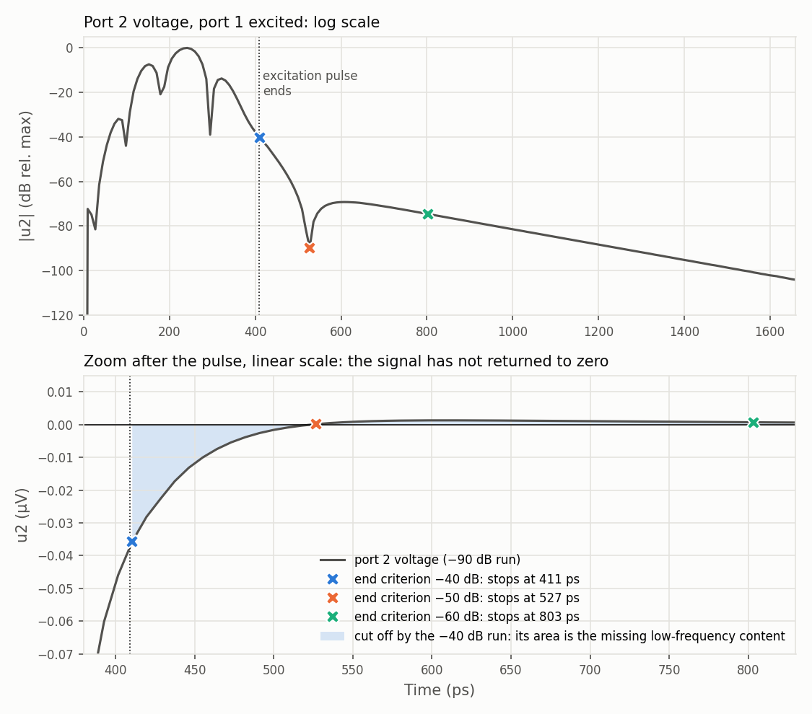
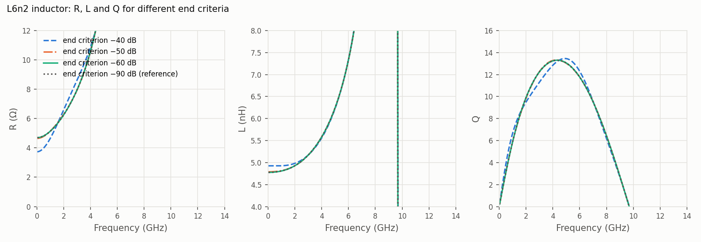
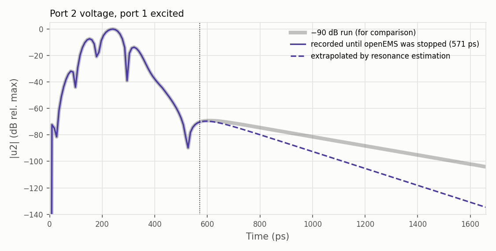
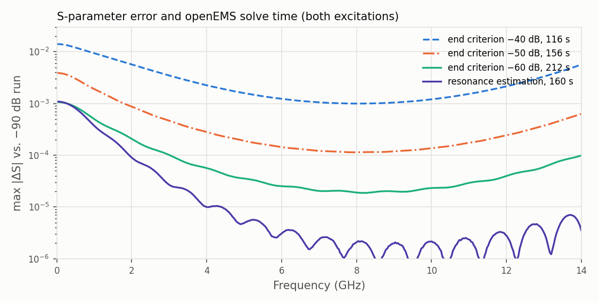

# Resonance estimation: shorter openEMS runs with accurate low-frequency results

openEMS stops a simulation when the energy left in the model has dropped below `settings['energy_limit']`. If that is too early, the result is wrong at low frequency; if it is too late, the run takes longer than needed. Finding the right value means running the model several times.

`settings['resonance_estimation'] = True` makes this decision automatic. While openEMS runs, the port signals are extended beyond the current time, and openEMS is stopped as soon as the extended result no longer changes.

This example shows the problem and the solution on the L6n2 inductor, then summarizes the results for five more examples.

**In short:** for the L6n2 inductor, resonance estimation gives the accuracy of a −60 dB run in 0.75× of its solve time, and 3.5× better accuracy than a −50 dB run in the same time. For five more examples from this repository (inductors, a MIM capacitor, PA core layouts), resonance estimation took 0.45–0.83× the solve time of a −60 dB run. For the inductors and the MIM capacitor, it was at least as accurate as the −60 dB run; for the MIM capacitor 20× more accurate, at the solve time of a −40 dB run.

## 1. The problem: openEMS stops before the signals have decayed

openEMS simulates in the time domain. It excites one port with a short pulse and records the voltages and currents at all ports, until the energy left in the model has dropped below `energy_limit`. The S-parameters are calculated from these signals with a Fourier transform. The transform assumes that the signals are complete, that is, that they have decayed to zero by the end of the record. Whatever comes after the end of the record is missing from the result.

The lower the frequency, the more the result depends on the slow part of the signals. At DC, the Fourier transform is just the area under the signal. A slow decay that is cut off is therefore an error in the DC and low-frequency result, and it shows as a ripple across the band.

The L6n2 inductor (6.2 nH, from the [L6n2 study](../measured_vs_simulated/more_accurate_models_L6n2/README.md)) shows this well. `run_L6n2_energy_limit.py` simulates it with end criteria −40, −50, −60 and −90 dB, with a 2 µm mesh for faster runs. The −90 dB run serves as the reference. All runs are identical up to the time where each one stops; only the length of the record differs.



- The **−40 dB** run stops at 411 ps, right at the end of the excitation pulse. The port 2 voltage is still at −40 dB of its peak and decays slowly back to zero: this is the inductor's L/R time constant. The shaded area in the lower plot is cut off.
- The **−50 dB** run stops at 527 ps, where the port 2 voltage passes through zero. It misses a second, slower part of the signal at about −70 dB that follows.
- The **−60 dB** run records this slow part until 803 ps. The **−90 dB** run continues to 1660 ps.

The effect on the inductor's resistance, inductance and Q factor (from the differential impedance between the two ports):



| Run | Stops at | Solve time | R @ 0.1 GHz | R @ 1 GHz | L @ 1 GHz | Peak Q | SRF |
|---|---|---|---|---|---|---|---|
| End criterion −40 dB | 411 ps | 116 s | 3.75 Ω | 4.65 Ω | 4.93 nH | 13.46 @ 4.90 GHz | 9.70 GHz |
| End criterion −50 dB | 527 ps | 156 s | 4.65 Ω | 5.14 Ω | 4.82 nH | 13.32 @ 4.27 GHz | 9.66 GHz |
| End criterion −60 dB | 803 ps | 212 s | 4.70 Ω | 5.14 Ω | 4.81 nH | 13.31 @ 4.34 GHz | 9.66 GHz |
| End criterion −90 dB (reference) | 1660 ps | 436 s | 4.70 Ω | 5.14 Ω | 4.81 nH | 13.31 @ 4.34 GHz | 9.66 GHz |

(Solve time: openEMS solve time for both port excitations together, on a 16-core workstation.)

At −40 dB, the low-frequency resistance is 20 % too low, the inductance 2.5 % too high, and the Q curve has the wrong shape. At −50 dB, the resistance is 1 % too low. From −60 dB on, the result does not change any more, but the run takes 1.8× as long as the −40 dB run. The SRF hardly depends on the end criterion: the resonance itself is well recorded in all runs.

For this inductor, −60 dB is enough. For another model, it can be −50 dB or −70 dB; the energy criterion does not tell which part of the result is still missing.

## 2. How commercial solvers handle this

Commercial time-domain field solvers have had a solution for a long time. They fit a model of decaying resonances to the recorded time signals, and use it to predict how the signals would have continued. The prediction is appended to the record before the Fourier transform. With this, the run can stop much earlier, as soon as the prediction no longer changes. The fit methods behind this come from signal processing (autoregressive models, Prony's method and its relatives), which is why this is known under names like "AR filter" or "resonance estimation".

## 3. Resonance estimation in gds2openEMS

`settings['resonance_estimation'] = True` brings the same idea to openEMS:

```python
settings['energy_limit'] = -60            # safety limit: openEMS stops here at the latest
settings['resonance_estimation'] = True   # stop earlier, once the extended S-parameters have converged
```

How it works, in short:

- **While openEMS runs**, gds2openEMS reads the port signals recorded so far, every 2 seconds. It describes them as the excitation pulse passing through a set of decaying resonances, and predicts how the signals continue. From the extended signals, it calculates the S-parameters of the excited port.
- **The stop rule:** the prediction is repeated with the record cut a little shorter (4 and 8 samples less). When all three predictions give the same S-parameters within 3·10⁻⁴, the result has converged, and openEMS is stopped.
- **After the run**, the extended signals are written to `sub-N/resonance_estimation/`, and `utilities.calculate_Sij()` uses them for the S-parameters. The original openEMS data is not changed.
- `energy_limit` stays as a safety limit: if the prediction has not converged by the time the energy has dropped to `energy_limit`, openEMS stops there as usual.

### How to set `energy_limit` with resonance estimation

With resonance estimation, `energy_limit` no longer decides when the run normally ends. It is the safety limit for the case that the prediction does not converge. Set it to the end criterion you would use without resonance estimation to get an accurate result, **−60 dB** for most models:

- **Use −60 dB, not the −40 dB of most example scripts.** If `energy_limit` is reached before the prediction has converged, openEMS stops there, as without resonance estimation. For a model with a slow decay, −40 dB comes first: the L6n2 inductor reaches −40 dB at 411 ps, but its prediction converges only at 562 ps. The run then ends with a short record that the stop rule has not confirmed, and there is no gain in time either.
- **A more negative value costs nothing while the prediction converges.** All tests in this folder were run with −60 dB, and every excitation was stopped by the stop rule before it reached −60 dB, so the limit had no effect on the solve time. A more negative value, such as −70 dB instead of −60 dB, only adds solve time for a model whose prediction does not converge, and then it gives that model a more accurate result.
- **Check the log.** `openEMS stopped: at its energy limit (energy_limit)` in `resonance_estimation.txt` means the limit came first. The result is then that of a plain run at this limit, extended only if the prediction passes the final check. If you see this for a model that needs a high low-frequency accuracy, make `energy_limit` more negative, for example −70 dB instead of −60 dB.

For the L6n2 inductor, openEMS was stopped after 571 ps, between the −50 dB and −60 dB stop times. The prediction (dashed) takes over at the end of the record:



The extrapolated signal decays faster than the real one (grey) from about 650 ps on. This is the slow part at −70 dB and below, which is only beginning when openEMS is stopped. Its effect on the result is small, as the comparison with the −90 dB reference shows:



| Run | Stops at | Solve time | R @ 0.1 GHz | L @ 1 GHz | Peak Q | max \|ΔS\| vs. −90 dB |
|---|---|---|---|---|---|---|
| End criterion −40 dB | 411 ps | 116 s | 3.75 Ω | 4.93 nH | 13.46 @ 4.90 GHz | 1.4·10⁻² |
| End criterion −50 dB | 527 ps | 156 s | 4.65 Ω | 4.82 nH | 13.32 @ 4.27 GHz | 3.9·10⁻³ |
| End criterion −60 dB | 803 ps | 212 s | 4.70 Ω | 4.81 nH | 13.31 @ 4.34 GHz | 1.1·10⁻³ |
| **Resonance estimation** | 571 ps | **160 s** | **4.70 Ω** | **4.81 nH** | **13.31 @ 4.34 GHz** | **1.1·10⁻³** |
| End criterion −90 dB (reference) | 1660 ps | 436 s | 4.70 Ω | 4.81 nH | 13.31 @ 4.34 GHz | |

Resonance estimation gives the −60 dB result in 0.75× of the time. At the lowest frequencies, its error is the same as that of the −60 dB run: both miss part of the slow −70 dB component. With increasing frequency, it becomes more accurate than the −60 dB run: 2× at 2 GHz, 10× at 10 GHz.

### What the log says

Each port excitation writes `resonance_estimation.txt` into its `sub-N` folder. For port 1 of the L6n2 inductor:

```
Resonance estimation for excitation [1]
openEMS stopped: converged after 562.4 ps (change 3.0e-04)
(openEMS then reports that the max. number of timesteps was reached: that refers to this stop, not to a timestep limit)
Recorded until 571.3 ps, 23 samples after the excitation
Method: known-input fit (ARX), 4 poles, slowest time constant 135.9 ps
Change against the extrapolation 4 samples earlier: 5.6e-04 (limit 3e-03)
Tail check: effective time constant 116.2 ps vs. 198.4 ps of recorded free decay (limit 3x), growth 1.07 (limit 3)
Extended signals written to resonance_estimation/, used for the S-parameters
```

The first line after the header says why openEMS stopped: "converged", or "at its energy limit". The last line says whether the extended signals are used. If the extended signals are not trusted, the last line says so, and the S-parameters are calculated from the original openEMS data, as without resonance estimation.

When resonance estimation stops openEMS, openEMS itself prints a warning that the maximum number of timesteps was reached. That warning refers to this stop; no timestep limit was hit.

### Safeguards

A prediction from a short record can go wrong, for example with a slow resonance that the record cannot confirm. Every prediction is therefore checked before it is used:

- **The predicted tail must not grow**, and it must not decay much more slowly than the signals did in the recorded part after the pulse.
- **After the run, the prediction is repeated** with 4 samples less. If the two predictions disagree by more than 3·10⁻³, the prediction is not trusted.

A prediction that fails a check during the run does not count as converged, so openEMS continues (this costs time, not accuracy). After the run, a prediction that fails the checks is not used.

## 4. More examples: run time and accuracy

The same comparison for the other examples in this repository that use a stricter end criterion than −40 dB. Each was run unchanged except for the end criterion, and once with resonance estimation (`energy_limit` −60 dB as safety limit):

| Model | Example |
|---|---|
| MIM capacitor, 0–100 GHz | [`workflow/run_rfcmim_2port_full.py`](../../workflow/run_rfcmim_2port_full.py) |
| 2 nH inductor, 2 ports | [`workflow/run_inductor_2port.py`](../../workflow/run_inductor_2port.py) |
| 2 nH inductor, 1 differential port | [`workflow/run_inductor_diffport.py`](../../workflow/run_inductor_diffport.py) |
| PA core, 5 ports, 0–350 GHz | [`core_transistor_3port_bce`](../core_transistor_3port_bce/) |
| PA core, 4 ports, 0–350 GHz | [`numThreads`](../numThreads/) |

Solve time, and the S-parameter error against a −90 dB run (max |ΔS| over all S-parameters and frequencies):

| Model | −40 dB | −60 dB | Resonance estimation | Resonance estimation vs. −60 dB |
|---|---|---|---|---|
| L6n2 inductor (above) | 116 s, 1.4·10⁻² | 212 s, 1.1·10⁻³ | 160 s, 1.1·10⁻³ | 0.75× the time, same error |
| MIM capacitor | 185 s, 2.5·10⁻¹ | 404 s, 2.2·10⁻² | 181 s, 1.1·10⁻³ | 0.45× the time, 20× smaller error |
| 2 nH inductor, 2 ports | 276 s, 1.1·10⁻² | 857 s, 1.7·10⁻³ | 523 s, 4.0·10⁻⁴ | 0.61× the time, 4× smaller error |
| 2 nH inductor, 1 port | 148 s, 1.7·10⁻² | 336 s, 1.4·10⁻³ | 278 s, 9.0·10⁻⁵ | 0.83× the time, 15× smaller error |
| PA core, 5 ports | 65 s, 1.4·10⁻³ | 182 s, 5.9·10⁻⁴ | 81 s, 1.5·10⁻³ | 0.45× the time, −40 dB accuracy |
| PA core, 4 ports | 40 s, 9.6·10⁻⁴ | 107 s, 2.0·10⁻⁴ | 52 s, 8.3·10⁻⁴ | 0.49× the time, −40 dB accuracy |

(openEMS v0.37.0-rc3, gds2openEMS 0.6.1, solve time for all port excitations together. In all runs with resonance estimation, every excitation was stopped by the stop rule before the −60 dB limit.)

- **The MIM capacitor** has the largest error without resonance estimation: even at −60 dB, its capacitance at 1 GHz is 5 % off. Its RC time constant with the two 50 Ω ports (about 70 ps) is longer than its excitation pulse (57 ps). Resonance estimation is 20× more accurate than the −60 dB run, at the solve time of the −40 dB run.
- **The 2 nH inductors** behave like the L6n2 inductor: resonance estimation is more accurate than −60 dB, in less time.
- **The PA cores** are already accurate at −40 dB (error 1.4·10⁻³ or less). Resonance estimation stops them right after the excitation pulse, with about −40 dB accuracy. If you need the −60 dB accuracy for such a model, use −60 dB without resonance estimation.

## 5. When to use it

- **Use it for models that need a stricter end criterion than −40 dB** (−50 dB, −60 dB or more negative): inductors, capacitors, and other models where the low-frequency R, L, C or Q matter. Set `energy_limit` to −60 dB as the safety limit, see [How to set `energy_limit`](#how-to-set-energy_limit-with-resonance-estimation).
- **Little to gain for models that decay fast** after the excitation pulse, for example transistor and PA core layouts at high frequency. These reach the end criterion right after the pulse anyway, because the signal can rush through the traces to other port with no significant time constant.
- **Field dumps and nf2ff:** these collect their data during the run, so openEMS is not stopped early. The port signals are still extended after the run.
- **Check the log** (`resonance_estimation.txt`) for models that matter, at least for the first run of a new kind of model.
- The rules (tolerances, number of samples) were set and tested on the models in this folder and the examples listed above. They are not a guarantee for every model. For a new kind of model, compare once with a run at a more negative `energy_limit`, for example −70 dB instead of −60 dB.

## Appendix: method details

For readers who want to know more; none of this needs to be set.

- **Two fit methods.** The *known-input fit* (ARX model: autoregressive with the excitation as known input) describes each port signal as the excitation filtered by a set of poles shared by all port signals of the excitation. It also uses the samples recorded while the pulse is still on, so it works when the record ends shortly after the pulse. The *free-decay fit* (matrix pencil) fits damped oscillations to the samples after the excitation has dropped below −60 dB of its peak. It is used when at least 30 such samples are recorded; otherwise the known-input fit is used. Poles outside the unit circle (growing) are reflected inside.
- **Model order.** Each order is fitted without the last 6 recorded samples and has to predict them. The order is raised while the prediction error is above 1 %, or while the next order still improves it at least 10×.
- **Stop rule.** Extrapolations from the record cut at N, N−4 and N−8 samples, all with the same method, must agree within 3·10⁻⁴ (max |ΔS| of the excited port's S-parameter column) and pass the tail check. The rule is checked at every new sample.
- **Tail check.** For a decaying exponential with amplitude A at the end of the record and time constant τ, the energy of the tail is A²·τ/2. From the predicted tail energy of all port signals together (each normalized to its peak), this gives an effective time constant, which must be at most 3× the free decay recorded after the pulse. The tail must not exceed 3× the signal level at the end of the record.
- **Final check.** After the run, the extrapolation from the complete record must agree with the one from 4 samples less within 3·10⁻³, and pass the tail check. If it does not, and openEMS was stopped by the stop rule, the extrapolation that met the stop rule is used; otherwise the original data is used.
- The extrapolated tail continues until the slowest pole has decayed to 10⁻⁷, but not longer than 20× the recorded length.
- Implementation: `util_resonance_estimation.py` in gds2openEMS.

## Files

- `run_L6n2_energy_limit.py`: the L6n2 model with the five cases (−40, −50, −60, −90 dB, resonance estimation). Cases are selected by name on the command line, e.g. `python run_L6n2_energy_limit.py resonance_estimation`; without arguments, all cases run one after another.
- `L6n2_with_ports.gds`, `openEMS_SG13G2_200um.xml`: layout with ports and stackup, from the L6n2 study.
- `results/plot_report.py`: the plots and tables of this README. It reads the openEMS output in `output/` (not in the repository; run the model script first).
- `results/*.s2p`: the S-parameters of the five runs.
- `results/plots/`: the plots.
- `openEMS_native_implementation.md`: notes for the openEMS maintainers on how this could be implemented in openEMS itself.
